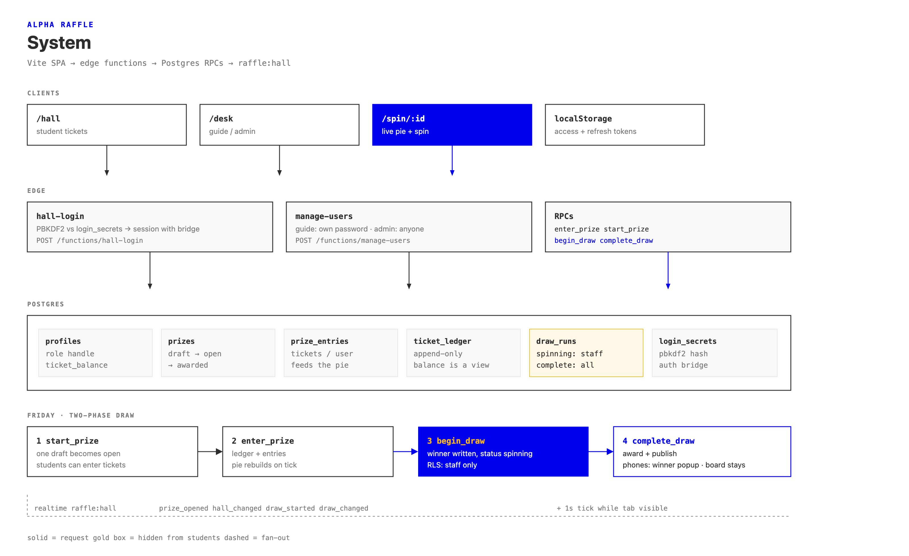

# Alpha Raffle

Friday prize draw for Alpha High School, Austin.

One prize at a time. Students put tickets in. The pie fills live. Spin, and every phone in the room shows who won.

**Live site:** [ak29gamq.insforge.site](https://ak29gamq.insforge.site)



## Sign in

Students use their school email, or just the part before `@`.

Guides and admins: open **If you're a guide or admin** at the bottom of the sign-in page. There is no staff tab.

| | Email | Password |
|---|---|---|
| Admin | `test@alpha.school` | `alpha-hall` |
| Guide | classroom passcode | `2468` |
| Students | `test1@alpha.school` … `test6@alpha.school` | `alpha` |

A guide can change only their own password (that is also the classroom passcode). An admin can change anyone’s.

## Run it

```bash
cp .env.example .env.local
npm install
npm run dev
```

Fill `VITE_INSFORGE_URL` and `VITE_INSFORGE_ANON_KEY` from your InsForge project.

## Use it at another school

Set the school name and email domain, apply `migrations/` in order, deploy the functions, run `npm run seed`, deploy the frontend.

Full steps: [docs/MIGRATE.md](docs/MIGRATE.md)  
Colors and type: [docs/STYLE.md](docs/STYLE.md)  
For coding agents: [AGENTS.md](AGENTS.md)

Source: [docs/diagrams/friday-raffle.svg](docs/diagrams/friday-raffle.svg). Editable copy: [friday-flow](https://draw.insforge.site/#p=alpha-raffle/friday-flow).

## License

MIT
