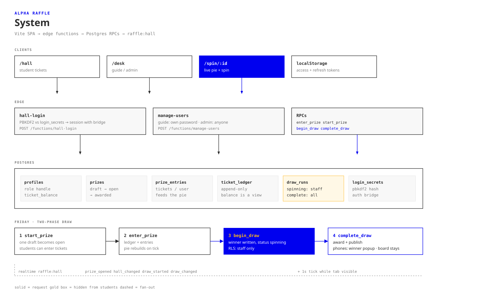

# Alpha Raffle

Friday, one prize at a time.

A guide starts a draft. Students put tickets in. The pie fills while they watch. Spin. Every phone in the room shows who won.

Built for [Alpha High School](https://alphahigh.school), Austin. Easy to stand up at another school.

**Live:** [ak29gamq.insforge.site](https://ak29gamq.insforge.site)

[](https://draw.insforge.site/#p=alpha-raffle/friday-flow)

The board is editable on the [Draw](https://draw.insforge.site) Excalidraw clone: [friday-flow](https://draw.insforge.site/#p=alpha-raffle/friday-flow).

## Sign in

Use the email, or just the part before `@`.

| | Email | Password |
|---|---|---|
| Admin | `test@alpha.school` | `alpha-hall` |
| Guide | classroom passcode | `2468` |
| Students | `test1@alpha.school` … `test6@alpha.school` | `alpha` |

## What it does

1. **Drafts stay hidden.** Students see “No prize is open yet” until a guide hits Start.
2. **One prize.** Friday is a line, not a pile.
3. **Live pie.** Tickets show up in about a second. No reload.
4. **Honest wheel.** The last slice always closes 360°. The first slice is gold, never page blue — a one-person pie has to be visible on the blue board.
5. **Spin, then tell.** The winner is chosen before the wheel finishes, then published so phones do not spoil it.

## Run it here

```bash
cp .env.example .env.local
# fill VITE_INSFORGE_URL and VITE_INSFORGE_ANON_KEY
npm install
npm run dev
```

## Put it in another school

That is the point of this repo. About twenty minutes if you already have an [InsForge](https://insforge.dev) project.

```bash
VITE_SCHOOL_NAME=Lincoln High
VITE_SCHOOL_SHORT=LINCOLN
VITE_EMAIL_DOMAIN=lincoln.school
```

Then apply `migrations/` in order, deploy the three functions, run `npm run seed`, deploy the frontend. Step-by-step: **[docs/MIGRATE.md](docs/MIGRATE.md)**.

## For agents

**[AGENTS.md](AGENTS.md)** is the map: auth, RPCs, the gotchas we already paid for, what never to invent.

**[docs/STYLE.md](docs/STYLE.md)** is the color law. White pages. One blue. Montserrat. First pie slice is gold.

## Stack

Vite, React, TypeScript, Tailwind. Postgres and auth on InsForge. Edge functions for login and user create. Realtime channel `raffle:hall`, plus a 1s tick so a missed event still lands.

## License

MIT. Take it. Change the school name. Keep Friday simple.
